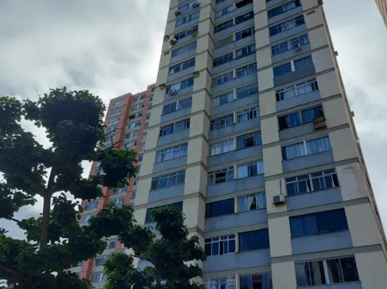

No coração de Salvador, onde o céu se encontra com um vibrante conjunto de edifícios que parecem ter saído de uma caixa de lápis de cor, reside o Edifício Condomínio Marcelo. Ali, entre cores e sombras, a vida de Vandinha, uma jovem trabalhadora, se entrelaça com a de diversos moradores, cada um carregando seus próprios segredos. Uma tragédia inesperada abala o prédio, revelando uma teia de mistérios que se estende por todos os andares. Através de múltiplos pontos de vista, o leitor é convidado a desvendar a verdade em uma jornada que explora temas como desigualdade social, violência e os fantasmas do passado.

A história é ambientada em algum lugar do final do século passado na capital baiana. 

Espero que gostem.

